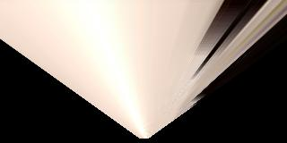
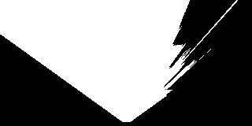
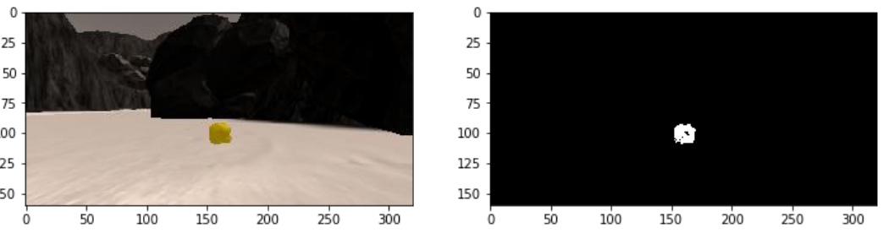
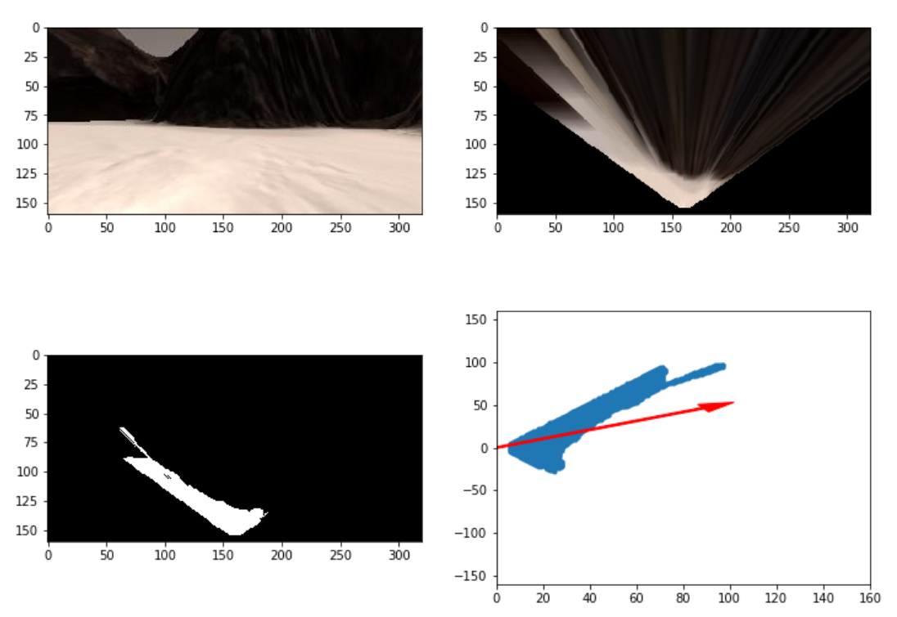

## Project: Search and Sample Return
The writeup / README should include a statement and supporting figures / images that explain how each rubric item was addressed, and specifically where in the code each step was handled.

# Videos
- [Notebook Analysis Output Video](https://github.com/Ultraman82/Rover-2/tree/master/output/test_mapping.mp4)
- [Screen Recording (ogv)(https://github.com/Ultraman82/Rover-2/tree/master/output/out.ogv)

### Notebook Analysis
#### 1. Run the functions provided in the notebook on test images (first with the test data provided, next on data you have recorded). Add/modify functions to allow for color selection of obstacles and rock samples
Describe in your writeup (and identify where in your code) how you modified or added functions to add obstacle and rock sample identification.

 1.  Calibrate images to convert rover views to  'top-down' map image. And warp them with cv2.getPerspectiveTransform, cv2.warpPerspective in def perspect_transform. Within the process, I put the the coordinates of grid vertexes.
 
 
 
 
 2. To define navigable terrain, used color threshold method. After creating empty array of image array which has same size of the orginal image,  applied brightness threshold of 160 on each RGB chanel. With that process, we can make binary image of navigable terrain. And for rock sample, I used specific RGB boundary of 110, 110, 50.
 Those are used in def color_thresh and def find_rocks.
 
 
 
 
 
  

#### 1. Populate the `process_image()` function with the appropriate analysis steps to map pixels identifying navigable terrain, obstacles and rock samples into a worldmap.  Run `process_image()` on your test data using the `moviepy` functions provided to create video output of your result. 

Describe in your writeup how you modified the process_image() to demonstrate your analysis and how you created a worldmap. Include your video output with your submission.

- First, we need to change image from the rover to 'top-down' viewd map image. To do this, I used cv2.getPerspectiveTransform,  cv2.warpPerspective module to calulate image with calibration in 'perspect_transform()'

  
  With that warped image and color thresholded image, we can mark navigable terrain on the map(threshed = color_thresh(warped))
  
  On the world map, I gave binary signal on all the rover's view at red chanel. and overwraped blue chanel on nevigabale terrain.
  
    data.worldmap[y_world, x_world, 2] = 255
    data.worldmap[obs_y_world, obs_x_world, 0] = 255
    
- Convert map image pixel values to rover-centric coords    
    xpix, ypix = rover_coords(threshed)
    
- Convert rover-centric pixel values to world coordinates using def pix_to_world

- Convert rover-centric pixel positions to polar coordinates 
    dist, angles = to_polar_coords(xpix, ypix)
    
 - If the rover finds a rock, It marks on the map through this lines and 'find_rock()' function
     rock_map = find_rocks(warped, levels = (110,110,50))
     if rock_map.any():
 
 rocks_threshed.png

 
  

### Autonomous Navigation and Mapping

#### 1. Fill in the `perception_step()` (at the bottom of the `perception.py` script) and `decision_step()` (in `decision.py`) functions in the autonomous mapping scripts and an explanation is provided in the writeup of how and why these functions were modified as they were.
perception_step() and decision_step() functions have been filled in and their functionality explained in the writeup.

#Perception_step()

 - Apply perspective transform 
 warped,mask = perspect_transform(Rover.img, source, destination)
 
 -  Apply color threshold to identify navigable terrain/obstacles
    threshed = color_thresh(warped)
    obs_map = np.absolute(np.float32(threshed) - 1)  *  mask
    
 - Update Rover.vision_image (this will be displayed on left side of screen)
    Rover.vision_image[:,:,2] = threshed * 255
    Rover.vision_image[:,:,0] = obs_map * 255
    
 - Convert map image pixel values to rover-centric coords    
    xpix, ypix = rover_coords(threshed)
    
 - Convert rover-centric pixel values to world coordinates
    world_size = Rover.worldmap.shape[0]
    scale = 2 * dst_size
    xpos = Rover.pos[0]
    ypos = Rover.pos[1]
    yaw = Rover.yaw
    x_world, y_world = pix_to_world(xpix, ypix, xpos, ypos,
                                yaw, world_size, scale)
    obsxpix, obsypix = rover_coords(obs_map)
    obs_x_world, obs_y_world = pix_to_world(obsxpix, obsypix, xpos, ypos,
                                           yaw, world_size, scale)
                                           
 - Update Rover worldmap (to be displayed on right side of screen)         
    Rover.worldmap[y_world, x_world, 2] += 10
    Rover.worldmap[obs_y_world, obs_x_world, 0] += 1
    
 - Convert rover-centric pixel positions to polar coordinates.   Update Rover pixel distances and angles
    dist, angles = to_polar_coords(xpix, ypix)
    Rover.nav_angles = angles
    
 - Dectect rocks and mark the location on the map.
    rock_map = find_rocks(warped, levels = (110,110,50))
    if rock_map.any():
      rock_x, rock_y = rover_coords(rock_map)
      rock_x_world, rock_y_world = pix_to_world(rock_x, rock_y, xpos, ypos,
                                                yaw, world_size, scale)
      rock_dist, rock_ang = to_polar_coords(rock_x, rock_y)
      rock_idx = np.argmin(rock_dist)
      rock_xcen = rock_x_world[rock_idx]
      rock_ycen = rock_y_world[rock_idx]
      
      Rover.worldmap[rock_ycen, rock_xcen, 1] = 255
      Rover.vision_image[:,:,1] = rock_map = 255
      
#Decision Step()

 First, it checks if there is a data from the vision.
 
  Yes = It checks the rover is forward mode.
  
      Yes = It checks there is enough nevigable terrain.
      
          Yes = It checks the speed is max
          
              Yes = Keep moving(throttle = 0) within +_ 15 angle adjustment 
              
              No  = Set throttle value to throttle setting
              
          No = Stop
          
      No = It checkes the velocity of the rover is faster than 0.2
      
          Yes = Keep trying to stop
          
          No = It checks if there's a path forward.
          
              Yes = Start to go forward
              
              No = Turn around
              
#### 2. Launching in autonomous mode your rover can navigate and map autonomously.  Explain your results and how you might improve them in your writeup. 

Here I'll talk about the approach I took, what techniques I used, what worked and why, where the pipeline might fail and how I might improve it if I were going to pursue this project further.  

